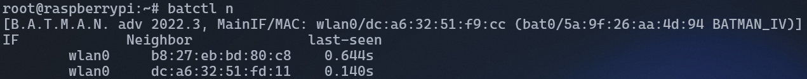
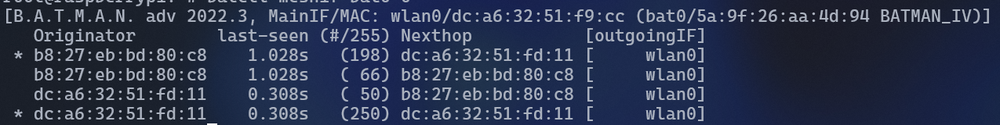
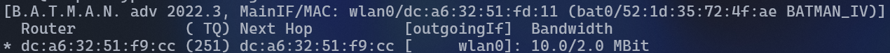
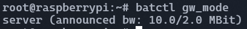
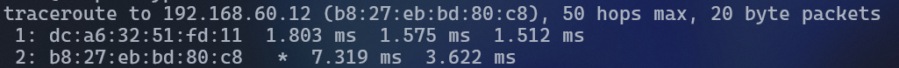
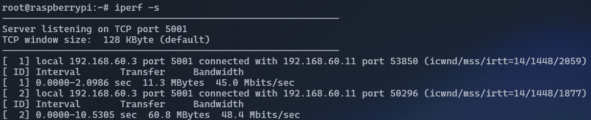
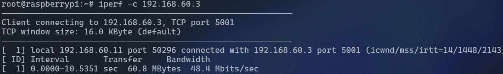

# batman_adhoc_network

[](https://github.com/tholeb/batman_adhoc_network/actions/workflows/ansible-lint.yml)

## Contexte 

Ce projet à pour but de mettre en place un réseau en utilisant le protocole B.A.T.M.A.N Ad-HOC. 
Il permet la création de réseaux ad hoc, où les nœuds communiquent directement entre eux sans infrastructure centralisée. En effectuant notamment un routage sur la couche 2 du modele OSI (Liason Adressage physique adresse MAC).

Par exemple il peut étre utilisé  dans l'armée pour établir rapidement un réseau de communication fiable et sécurisé entre les différentes troupes déployées sur le terrain. Les soldats pourraient configurer des dispositifs compatibles avec BATMAN, tels que des radios logicielles ou des dispositifs embarqués, pour former un réseau maillé ad hoc. Ce réseau permettrait aux troupes de partager des informations critiques telles que leur position. Et ça sans passer par un réseau traditionnel qui pourrait étre vulnérable.

Le protocole à donc plusieurs avantages mais l'un de ses désavantages est que tous les noeuds de confiance.


## Installation

### Prérequis
- Ansible
- Accès aux machines via SSH

### Configuration
Modifier `inv/inventory.ini` pour ajouter/éditer les machines à configurer.
Il est important d'avoir une variable `numero` et `lettre` sur toutes les machines
Pour la gateway, il faut ajouter `master=true`.

L'inventaire peut être au [format ini ou yaml](https://docs.ansible.com/ansible/latest/inventory_guide/intro_inventory.html).

### Ansible
Pour lancer le playbook : 
```sh
ansible-playbook batman.yml
```

Il est possible de spécifier un (ou plusieurs) role précis avec les tags `-t <role>[,<role]`

## Lancement du réseau
### Client :
```sh
sudo batctl gw_mode client
sudo dhclient bat0
```

### Gateway :
L'accès à internet se fait par une connexion usb avec le téléphone (point d'accès par USB)

```sh
sudo dhclient usb0
sudo batctl gw_mode server

sudo iptables -t nat -A POSTROUTING -o usb0 -j MASQUERADE
sudo iptables -A FORWARD -i usb0 -o eth0 -m state --state RELATED,ESTABLISHED -j ACCEPT
sudo iptables -A FORWARD -i eth0 -o usb0 -j ACCEPT
```


### Test du réseau

#### Affichages des noeuds du réseaux:
```sh
sudo batctl n
```


#### Table de routage de batman:
```sh
sudo batctl meshif bat0 o
```


#### Affichage des gateway (client):
```sh
sudo batctl gwl
```



#### Affichage du mode de la gateway (client ou serveur):
```sh
sudo batctl gw_mode
```
Sur un serveur :



Sur un client : 


#### Traceroute pour afficher par exemple les sauts entre deux noeuds:
```sh
sudo batctl traceroute 192.168.60.11
```


#### Test qualité de connection (internet) :
```sh
# serveur
iperf -s
# client
iperf -c 192.168.60.3
```

Serveur : 


client :



#### Topologie
- 192.169.50.* -> réseau de test (connecté par eth0)
- 192.169.60.* -> réseau wifi (connecté sur wlan0)


## Documentation
- batman-adv : https://www.open-mesh.org/projects/batman-adv/wiki
- Ansible : https://docs.ansible.com/